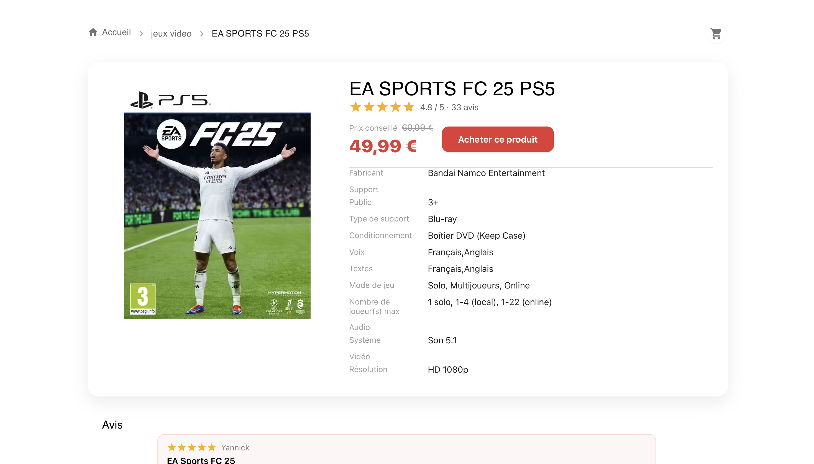

# 🛍️ Rakuten Product Detail Page

A responsive **Product Detail Page** built with **React**, **TypeScript**, **Vite**, **Material UI**, and **React Query**.  
This project was developed as part of a **Frontend Developer Intern coding assignment** for the Rakuten Visitor Team.

---

## 🧩 Project Overview

The objective of this assignment was to create a Product Detail Page that retrieves and displays product data from the given Rakuten API endpoint.

API Endpoint: https://api-rakuten-vis.koyeb.app/product/<productId>

For this implementation, the chosen product ID is: 13060247469 (Gaming CD).

The page dynamically fetches and displays:
- Product image, title, and brand  
- Price (including discount when available)  
- Product description and technical details  
- Reviews and ratings (if available)  
- Breadcrumb navigation and a static cart icon  
- Friendly loading and error states  

---

To switch products, just edit the constant in `src/ProductPage.tsx`:
const PRODUCT_ID = '13060247469'

## ⚙️ Installation & Setup

1. Clone the repository
git clone https://github.com/dinaosaure/product-page.git
cd product-page/
2. Install dependencies
npm install
3. Start the development server
npm run dev

The page will be available at http://localhost:5173 by default (or another port if 5173 is already in use).

## 🖼️ Preview 

